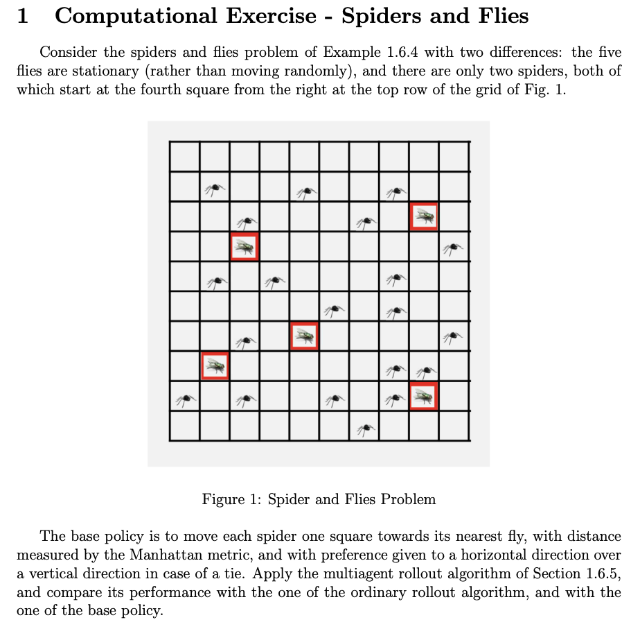

# rl_course
Course Repo for Reinforcement Learning Offered by Prof. Dmitri Bertsekas

## Spider and Flies - Multi-Agent RL Problem

## Using Base Policy

Using base policy with the given starting point of the spiders and flies, the spiders caught the flies in 25 moves. The code to replicate can be found [here](/Spiders_Flies_MARL/)

## Using Multi-agent Rollout

In Multi-agent Rollout, only one agent moves at a time and performs one-step look-ahead minimization and terminal cost approximation using base policy. Using multi-agent rollout, it took 33 joint moves as only one agent moves at a time. Invidual spider moves were 17 and 16 for spider 1 and 2 respectively. 

